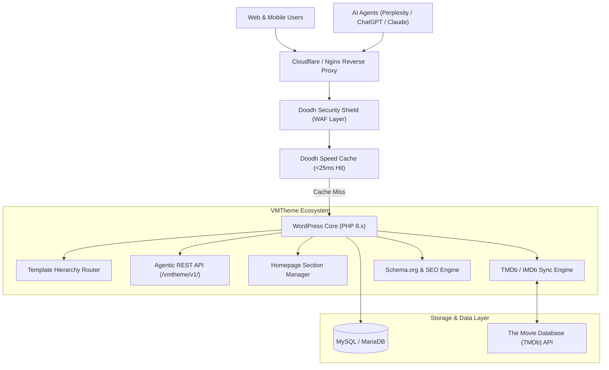
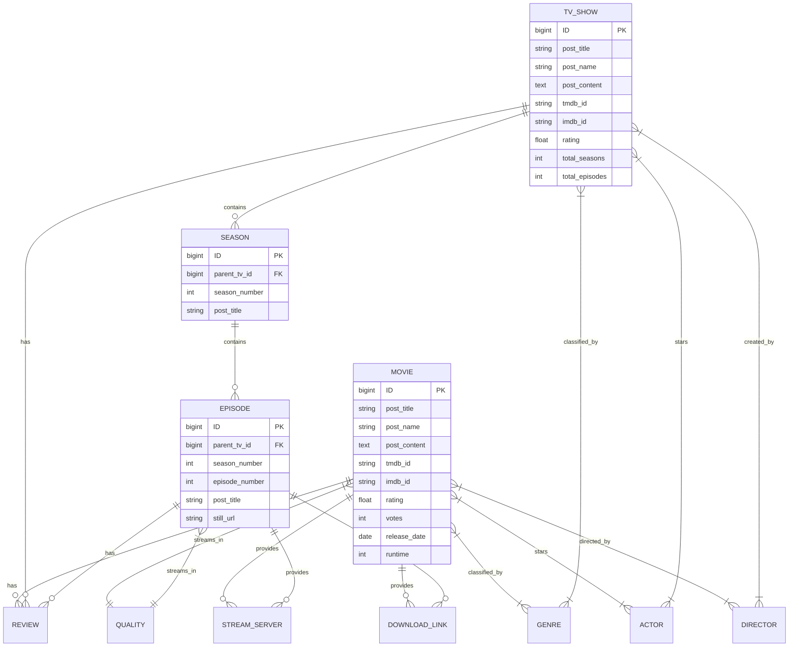

# 🎬 VMTheme (DoodhTheme) — Enterprise Movie & TV Streaming Platform

[](https://wordpress.org)
[](https://php.net)
[](#-seo-schemaorg--structured-data-engine)
[](#-llm--ai-browser-agentic-architecture)
[](#)

**VMTheme (DoodhTheme)** is a production-ready, enterprise-grade WordPress theme and ecosystem engineered for high-traffic movie, TV series, anime streaming portals, video catalogs, and cinema databases. It combines senior-level software architecture, native TMDb/IMDb delta data synchronization, automated Schema.org rich snippets, machine-readable LLM/AI agent endpoints, a modular Homepage Section Manager, high-performance disk caching, and multi-vector cybersecurity.

---

## 📑 Table of Contents

1. [Architectural Overview & Core Tech Stack](#-architectural-overview--core-tech-stack)
2. [Project & File Hierarchy Structure](#-project--file-hierarchy-structure)
3. [Database Architecture & Data Design](#-database-architecture--data-design)
   - [Custom Post Types (CPTs) & Rewrites](#custom-post-types-cpts--rewrites)
   - [Custom Taxonomies & Rewrites](#custom-taxonomies--rewrites)
   - [Entity-Relationship Diagram (ERD)](#entity-relationship-diagram-erd)
   - [Complete Post Meta Dictionary](#complete-post-meta-dictionary)
   - [Term Meta Dictionary](#term-meta-dictionary)
4. [TMDb & IMDb Data Ingestion & Delta Sync Engine](#-tmdb--imdb-data-ingestion--delta-sync-engine)
   - [API Endpoints & Integration](#api-endpoints--integration)
   - [Field Mapping Specification](#field-mapping-specification)
   - [Delta Synchronization & Review Ingestion](#delta-synchronization--review-ingestion)
   - [4-Tier Duplicate Prevention & Data Validator](#4-tier-duplicate-prevention--data-validator)
5. [SEO, Schema.org & Structured Data Engine](#-seo-schemaorg--structured-data-engine)
   - [JSON-LD Structured Data Graph](#json-ld-structured-data-graph)
   - [SERP BreadcrumbList Architecture](#serp-breadcrumblist-architecture)
   - [Dynamic XML Sitemaps & robots.txt](#dynamic-xml-sitemaps--robotstxt)
6. [LLM & AI Browser Agentic Architecture](#-llm--ai-browser-agentic-architecture)
   - [Standard Discovery Manifests (`llms.txt` & `llms-full.txt`)](#standard-discovery-manifests-llmstxt--llms-fulltxt)
   - [Agentic Machine-Readable REST APIs](#agentic-machine-readable-rest-apis)
   - [AI Crawler Permission Matrix](#ai-crawler-permission-matrix)
7. [Dynamic Homepage Section Manager](#-dynamic-homepage-section-manager)
   - [Admin Control Dashboard](#admin-control-dashboard)
   - [Section Hierarchy & Configurable Controls](#section-hierarchy--configurable-controls)
   - [Graceful Conditional Rendering Pipeline](#graceful-conditional-rendering-pipeline)
8. [Core Modules & Streaming Features](#-core-modules--streaming-features)
   - [Multi-Server Video Player & Embed Switcher](#multi-server-video-player--embed-switcher)
   - [Downloads Manager](#downloads-manager)
   - [Instant Debounced AJAX Search](#instant-debounced-ajax-search)
   - [Community Reviews & Weighted Rating Engine](#community-reviews--weighted-rating-engine)
   - [Client-Side Watchlist (LocalStorage)](#client-side-watchlist-localstorage)
   - [301 Redirects & 404 Auto-Healing](#301-redirects--404-auto-healing)
   - [Dynamic Brand & Identity Engine](#dynamic-brand--identity-engine)
9. [Companion Security & Performance Plugins](#-companion-security--performance-plugins)
   - [Doodh Security Shield (WAF & Firewall)](#1-doodh-security-shield-waf--firewall)
   - [Doodh Speed Optimizer (Caching & CLS)](#2-doodh-speed-optimizer-caching--cls)
   - [Doodh SEO Suite](#3-doodh-seo-suite)
10. [Installation, Configuration & Git Deployment](#-installation-configuration--git-deployment)
11. [Developer Extension Guide](#-developer-extension-guide)

---

## 🏛 Architectural Overview & Core Tech Stack



- **Core Engine**: WordPress 6.x+, PHP 7.4 to 8.3+ compatible.
- **Active Theme Architecture**: `doodhtheme` (Parent Theme engine) + `doodhtheme-child` (Customizations layer).
- **Branding Compatibility**: Dual prefix support (`VMTheme` / `DoodhTheme`) ensuring 100% backward and forward compatibility.
- **Performance Targets**: Sub-25ms page delivery with caching, 0.00 CLS (Cumulative Layout Shift), 95+ PageSpeed scores.
- **Data Integrity**: 4-point collision validator ensuring 0 duplicate titles, slugs, or TMDb/IMDb IDs.

---

## 📂 Project & File Hierarchy Structure

```text
c:\xampp\htdocs\movie/
├── index.php                                 # WordPress bootstrap
├── wp-config.php                             # Database & environment configurations
├── robots.txt                                # SEO & AI-Crawler optimized crawler rules
├── llms.txt                                  # Machine-readable LLM Agent discoverability manifest
├── llms-full.txt                             # Full API reference & data contract for AI Agents
├── wp-content/
│   ├── plugins/
│   │   ├── doodh-seo/                        # Yoast-alternative SEO suite & keyword analyzer
│   │   ├── doodh-security-shield/            # High-priority WAF, SQLi/XSS guard & login defense
│   │   ├── doodh-speed-optimizer/            # Disk page cache, JS deferral & CLS optimizer
│   │   └── doodhtheme-core/                  # Core post types, OpenGraph & sitemap ping hooks
│   └── themes/
│       ├── doodhtheme/                       # Parent Theme Engine
│       │   ├── style.css                     # Main theme stylesheet & metadata
│       │   ├── functions.php                 # Core theme setup, enqueues & module bootstrap
│       │   ├── header.php                    # Responsive navbar, search bar & AI manifest tags
│       │   ├── footer.php                    # Responsive footer, legal navigation & DMCA disclaimers
│       │   ├── index.php                     # Modular Homepage executing Homepage Section Manager
│       │   ├── archive-movies.php            # Movies archive with multi-parameter filter
│       │   ├── archive-tvshows.php           # TV Shows catalog with season counters
│       │   ├── single-movies.php             # Movie detail page (Player, Cast, Downloads, Reviews)
│       │   ├── single-tvshows.php            # TV Series hub (Seasons tabbed, Episodes list)
│       │   ├── single-episodes.php           # Episode streaming player with Next/Prev navigators
│       │   ├── taxonomy.php                  # Taxonomy archive (Genre, Release Year, Quality)
│       │   ├── taxonomy-dtcast.php           # Actor bio hero & filmography catalog
│       │   ├── taxonomy-dtdirector.php       # Director bio hero & directed works grid
│       │   ├── search.php                    # Search results layout with live refinement
│       │   ├── 404.php                       # Error template with search auto-suggest
│       │   ├── page-top-imdb.php             # Top 100 IMDb Leaderboard (#1-#100 rank badges)
│       │   ├── page-genres.php               # Visual 3D gradient genres hub
│       │   ├── page-years.php                # Release timeline (1990-2026)
│       │   ├── page-watchlist.php            # LocalStorage client-side bookmark manager
│       │   ├── page-about.php                # Platform overview & stats
│       │   ├── page-contact.php              # AJAX contact form handler
│       │   ├── page-dmca.php                 # DMCA copyright compliance policy
│       │   ├── page-request.php              # Title request submission form
│       │   ├── assets/
│       │   │   ├── css/
│       │   │   │   └── doodhtheme.css        # Master responsive layout, glassmorphic UI & modals
│       │   │   ├── js/
│       │   │   │   └── doodhtheme.js         # Real-time search, rating handler, player & watchlist
│       │   │   └── images/
│       │   │       ├── poster-placeholder.svg    # 300x450 fallback SVG
│       │   │       ├── backdrop-placeholder.svg  # 1280x720 16:9 fallback SVG
│       │   │       └── avatar-placeholder.svg    # 200x200 Actor/Director fallback SVG
│       │   └── inc/
│       │       ├── agentic-api.php           # LLM/AI Agent REST APIs (/vmtheme/v1/)
│       │       ├── homepage-manager.php      # Homepage layout manager & WP Admin dashboard
│       │       ├── seo-schema.php            # Schema.org JSON-LD graph & BreadcrumbList
│       │       ├── tmdb-fetcher.php          # TMDb/IMDb API sync, auto-importer & reviews sync
│       │       ├── duplicate-validator.php   # 4-Field unique collision prevention guard
│       │       ├── post-types.php            # CPTs: movies, tvshows, seasons, episodes
│       │       ├── taxonomies.php            # Taxonomies: genres, release-year, quality, cast, director
│       │       ├── meta-boxes.php            # Custom Admin metaboxes (IDs, links, player sources)
│       │       ├── player.php                # Multi-server streaming embed & HTML5 player
│       │       ├── downloads-manager.php     # Multi-quality download links engine
│       │       ├── reviews-system.php        # 10-Star user reviews & weighted rating calculator
│       │       ├── ajax-search.php           # Fast instant AJAX search endpoint
│       │       ├── filter.php                # Multi-parameter AJAX & URL filter query parser
│       │       ├── brand-settings.php        # Dynamic Brand Name, Logo & identity manager
│       │       ├── sitemap-seo.php           # Dynamic XML sitemaps with Google Image tags
│       │       ├── redirects-manager.php     # 301 Redirect engine & 404 dead link healer
│       │       ├── ads-manager.php           # Strategic header, player, grid & footer ad slots
│       │       └── user-auth.php             # User login, registration & watchlist sync
│       └── doodhtheme-child/                 # Child Theme for persistent customizations
│           ├── style.css
│           └── functions.php
```

---

## 🗄 Database Architecture & Data Design

### Custom Post Types (CPTs) & Rewrites

| Post Type | Singular / Plural Name | DB Identifier | URL Rewrite Pattern | Template Handler |
| :--- | :--- | :--- | :--- | :--- |
| **Movies** | Movie / Movies | `movies` | `/movie/%postname%/` | `single-movies.php` |
| **TV Shows** | TV Show / TV Shows | `tvshows` | `/tvshows/%postname%/` | `single-tvshows.php` |
| **Seasons** | Season / Seasons | `seasons` | `/seasons/%postname%/` | `single-tvshows.php` |
| **Episodes** | Episode / Episodes | `episodes` | `/episode/%postname%/` | `single-episodes.php` |

### Custom Taxonomies & Rewrites

| Taxonomy Slug | UI Label | Associated CPTs | URL Rewrite Pattern | Hierarchical |
| :--- | :--- | :--- | :--- | :--- |
| **`genres`** | Genres | `movies`, `tvshows` | `/genre/%term%/` | Yes (True) |
| **`release-year`** | Release Year | `movies`, `tvshows` | `/release-year/%term%/` | No (False) |
| **`dtquality`** | Video Quality | `movies`, `tvshows`, `episodes` | `/quality/%term%/` | No (False) |
| **`dtcast`** | Actors / Cast | `movies`, `tvshows` | `/cast/%term%/` | No (False) |
| **`dtdirector`** | Directors | `movies`, `tvshows` | `/director/%term%/` | No (False) |

---

### Entity-Relationship Diagram (ERD)



---

### Complete Post Meta Dictionary

All custom data points are indexed in `wp_postmeta`:

| Meta Key | Data Type | Applicable CPTs | Description & Example |
| :--- | :--- | :--- | :--- |
| **`_doodh_tmdb_id`** | `INTEGER` | `movies`, `tvshows` | Unique The Movie Database ID (e.g. `157336`) |
| **`_doodh_imdb_id`** | `VARCHAR(20)` | `movies`, `tvshows` | Unique IMDb alphanumeric ID (e.g. `tt0816692`) |
| **`_doodh_poster_url`** | `TEXT (URL)` | `movies`, `tvshows` | Vertical 2:3 poster URL (`https://image.tmdb.org/t/p/w500/...`) |
| **`_doodh_backdrop_url`**| `TEXT (URL)` | `movies`, `tvshows` | Widescreen 16:9 backdrop banner (`https://image.tmdb.org/t/p/original/...`) |
| **`_doodh_rating`** | `FLOAT(3,1)` | `movies`, `tvshows`, `episodes` | Aggregate score (1.0 to 10.0, e.g. `8.7`) |
| **`_doodh_votes`** | `INTEGER` | `movies`, `tvshows`, `episodes` | Total count of aggregate user & TMDb votes (e.g. `24500`) |
| **`_doodh_release_date`** | `DATE` | `movies`, `tvshows`, `episodes` | Air / release date formatted `YYYY-MM-DD` |
| **`_doodh_runtime`** | `INTEGER` | `movies`, `episodes` | Duration in minutes (e.g. `169` -> formats to `2h 49m`) |
| **`_doodh_quality`** | `VARCHAR(30)` | `movies`, `tvshows`, `episodes` | Quality badge (`4K Ultra HD`, `1080p FHD`, `720p HD`, `CAM`) |
| **`_doodh_trailer`** | `TEXT (URL)` | `movies`, `tvshows` | Official YouTube/Vimeo embed trailer URL |
| **`_doodh_tagline`** | `TEXT` | `movies`, `tvshows` | Short promotional slogan |
| **`_doodh_player_servers`**| `SERIALIZED ARRAY` | `movies`, `episodes` | Array of stream sources: `[['name'=>'Server 1', 'url'=>'https://...'], ...]` |
| **`_doodh_download_links`**| `SERIALIZED ARRAY` | `movies`, `episodes` | Download sources: `[['label'=>'1080p', 'url'=>'https://...', 'size'=>'2.4 GB']]` |
| **`_doodh_tv_id`** | `BIGINT` | `seasons`, `episodes` | Parent `tvshows` Post ID |
| **`_doodh_season_number`** | `INTEGER` | `seasons`, `episodes` | Season index number (1, 2, 3...) |
| **`_doodh_episode_number`**| `INTEGER` | `episodes` | Episode index number (1, 2, 3...) |
| **`_doodh_still_url`** | `TEXT (URL)` | `episodes` | 16:9 episode thumbnail still URL |

### Term Meta Dictionary

Stored in `wp_termmeta`:

| Term Meta Key | Taxonomy | Data Type | Description |
| :--- | :--- | :--- | :--- |
| **`_dt_actor_photo`** | `dtcast` | `TEXT (URL)` | Headshot photo URL for actors (`https://image.tmdb.org/...`) |
| **`_dt_director_photo`** | `dtdirector` | `TEXT (URL)` | Portrait photo URL for directors/creators |

---

## 🔄 TMDb & IMDb Data Ingestion & Delta Sync Engine

Located in [`inc/tmdb-fetcher.php`](file:///c:/xampp/htdocs/movie/wp-content/themes/doodhtheme/inc/tmdb-fetcher.php):

### API Endpoints & Integration

The fetcher communicates with The Movie Database (TMDb) v3 API via authenticated HTTPS requests using `wp_remote_get()`:
- **Movies**: `https://api.themoviedb.org/3/movie/{tmdb_id}?api_key={key}&append_to_response=credits,reviews,videos,similar`
- **TV Series**: `https://api.themoviedb.org/3/tv/{tmdb_id}?api_key={key}&append_to_response=credits,reviews,videos,similar`
- **Seasons/Episodes**: `https://api.themoviedb.org/3/tv/{tmdb_id}/season/{season_number}?api_key={key}`
- **People / Cast Bio**: `https://api.themoviedb.org/3/person/{person_id}?api_key={key}`

### Field Mapping Specification

```text
TMDb API Response Payload                    WordPress Target
─────────────────────────────────────────────────────────────────────────────
response.title / response.name         ───►  wp_posts.post_title
response.overview                      ───►  wp_posts.post_content
response.id                            ───►  _doodh_tmdb_id (Meta)
response.imdb_id                       ───►  _doodh_imdb_id (Meta)
response.poster_path                   ───►  _doodh_poster_url (https://image.tmdb.org/t/p/w500/...)
response.backdrop_path                 ───►  _doodh_backdrop_url (https://image.tmdb.org/t/p/original/...)
response.vote_average                  ───►  _doodh_rating (Meta)
response.vote_count                    ───►  _doodh_votes (Meta)
response.release_date / first_air_date ───►  _doodh_release_date (Meta) & 'release-year' Taxonomy
response.runtime                       ───►  _doodh_runtime (Meta)
response.tagline                       ───►  _doodh_tagline (Meta)
response.genres[].name                 ───►  'genres' Taxonomy terms
response.credits.cast[].name           ───►  'dtcast' Taxonomy terms + _dt_actor_photo (Term Meta)
response.credits.crew[Director].name   ───►  'dtdirector' Taxonomy terms + _dt_director_photo
response.videos.results[Trailer]       ───►  _doodh_trailer (Meta)
```

### Delta Synchronization & Review Ingestion
1. **Delta Updates (Zero Overwrite Loss)**: When syncing an existing title, custom streaming links, custom download mirrors, and editorial descriptions are preserved. Only metadata (ratings, vote counts, newly aired episodes) is synchronized.
2. **Automated Review Ingestion**: TMDb community reviews are ingested into `wp_comments` (`comment_type = 'review'`).
3. **Weighted Rating Recalculation**:
   $$\text{Final Score} = \frac{(\text{TMDb Rating} \times \text{TMDb Votes}) + \sum(\text{Local User Ratings})}{\text{TMDb Votes} + \text{Local User Votes}}$$

### 4-Tier Duplicate Prevention & Data Validator
Located in [`inc/duplicate-validator.php`](file:///c:/xampp/htdocs/movie/wp-content/themes/doodhtheme/inc/duplicate-validator.php):
- **TMDb ID Guard**: Rejects import if `_doodh_tmdb_id` is already bound to another post.
- **IMDb ID Guard**: Rejects import if `_doodh_imdb_id` matches an existing entry.
- **Title Collision Guard**: Checks normalized alphanumeric title string against existing published posts.
- **Slug Guard**: Validates `post_name` uniqueness to avoid `-2`, `-3` slug permutations.
- **Live Admin UI Indicator**: An interactive AJAX check fires on `wp-admin/post-new.php` as the editor types.

---

## 🔍 SEO, Schema.org & Structured Data Engine

Located in [`inc/seo-schema.php`](file:///c:/xampp/htdocs/movie/wp-content/themes/doodhtheme/inc/seo-schema.php):

### JSON-LD Structured Data Graph

Automated JSON-LD graphs are injected into the `<head>` of every page matching Google's latest Rich Results specifications:

1. **Movie Schema (`schema.org/Movie`)**:
   - `name`, `image`, `description`, `dateCreated`, `datePublished`, `director`, `actor`, `genre`, `duration` (ISO 8601 `PT2H49M`), `trailer` (`VideoObject`).
   - `aggregateRating`: `ratingValue`, `bestRating: 10`, `worstRating: 1`, `ratingCount`.
2. **TV Series Schema (`schema.org/TVSeries`)**:
   - `name`, `image`, `description`, `numberOfSeasons`, `numberOfEpisodes`, `containsSeason`.
3. **TV Episode Schema (`schema.org/TVEpisode`)**:
   - `episodeNumber`, `partOfSeason`, `partOfSeries`, `timeRequired`.
4. **Website & SearchAction Schema (`schema.org/WebSite`)**:
   - Injects `SearchAction` enabling Google Sitelinks Search Box directly from SERP.
5. **Organization Schema (`schema.org/Organization`)**:
   - Dynamic brand metadata, logo, and social profile links.

### SERP BreadcrumbList Architecture

Every Movie, Show, and Episode generates hierarchical `BreadcrumbList` schemas:
```json
{
  "@context": "https://schema.org",
  "@type": "BreadcrumbList",
  "itemListElement": [
    { "@type": "ListItem", "position": 1, "name": "Home", "item": "https://domain.com/" },
    { "@type": "ListItem", "position": 2, "name": "Movies", "item": "https://domain.com/movie/" },
    { "@type": "ListItem", "position": 3, "name": "Interstellar (2014)", "item": "https://domain.com/movie/interstellar-2014/" }
  ]
}
```

### Dynamic XML Sitemaps & robots.txt

Located in [`inc/sitemap-seo.php`](file:///c:/xampp/htdocs/movie/wp-content/themes/doodhtheme/inc/sitemap-seo.php) and [`robots.txt`](file:///c:/xampp/htdocs/movie/robots.txt):
- **Sitemap Index**: `https://domain.com/sitemap.xml`
  - `/sitemap-movies.xml` (Includes Google `<image:image>` poster and backdrop tags)
  - `/sitemap-tvshows.xml`
  - `/sitemap-episodes.xml`
  - `/sitemap-taxonomies.xml` (Genres, Years, Quality, Actors, Directors)
  - `/sitemap-pages.xml` (Static pages, DMCA, About, Contact)

---

## 🤖 LLM & AI Browser Agentic Architecture

The platform provides first-class support for AI browsing agents (Perplexity, ChatGPT Search, Claude, Google Gemini):

### Standard Discovery Manifests (`llms.txt` & `llms-full.txt`)
- **[`llms.txt`](file:///c:/xampp/htdocs/movie/llms.txt)**: Root-level AI discoverability manifest outlining system capabilities, streaming catalog size, and direct REST API endpoints.
- **[`llms-full.txt`](file:///c:/xampp/htdocs/movie/llms-full.txt)**: Complete API contract, query parameters, taxonomy reference, and JSON response models.
- **`<link rel="alternate" type="text/markdown" title="LLM Agent Manifest" href="/llms.txt">`**: Embedded in [`header.php`](file:///c:/xampp/htdocs/movie/wp-content/themes/doodhtheme/header.php).

### Agentic Machine-Readable REST APIs
Located in [`inc/agentic-api.php`](file:///c:/xampp/htdocs/movie/wp-content/themes/doodhtheme/inc/agentic-api.php):

#### 1. Catalog Summary & Analytics
- **Endpoint**: `GET /wp-json/vmtheme/v1/agent-summary`
- **Response**: Platform metadata, counts (`total_movies`, `total_tvshows`, `total_episodes`), top genres, and featured cinema titles.

#### 2. High-Speed AI Search Engine
- **Endpoint**: `GET /wp-json/vmtheme/v1/search?q={query}&type={movies|tvshows}&limit={limit}`
- **Zero DOM Scraping**: Delivers clean, structured JSON:
  ```json
  {
    "total_found": 1,
    "query": "Inception",
    "results": [
      {
        "id": 104,
        "title": "Inception",
        "type": "movies",
        "year": "2010",
        "imdb_rating": 8.8,
        "quality": "4K Ultra HD",
        "genres": ["Action", "Sci-Fi", "Adventure"],
        "synopsis": "A thief who steals corporate secrets...",
        "poster_url": "https://...",
        "url": "https://domain.com/movie/inception-2010/"
      }
    ]
  }
  ```

### AI Crawler Permission Matrix
Configured in [`robots.txt`](file:///c:/xampp/htdocs/movie/robots.txt):
- **Allowed AI Agents**: `GPTBot`, `ClaudeBot`, `PerplexityBot`, `Google-Extended`, `Applebot-Extended`, `CCBot`.

---

## 🎛 Dynamic Homepage Section Manager

Located in [`inc/homepage-manager.php`](file:///c:/xampp/htdocs/movie/wp-content/themes/doodhtheme/inc/homepage-manager.php):

### Admin Control Dashboard
Navigate to **WP Admin → Theme → Homepage Manager**:

```text
┌────────────────────────────────────────────────────────────────────────┐
│ 🎬 VMTheme Homepage Section Manager                                    │
├────────────────────────────────────────────────────────────────────────┤
│ [ON] Spotlight Search Bar                                              │
│      Title: "Search 10,000+ Movies, TV Shows & Stars"                  │
│      Quick Tags: Action, Sci-Fi, Avengers, Avatar, Anime, Horror, 4K   │
├────────────────────────────────────────────────────────────────────────┤
│ [ON] Hero Showcase Banner                                              │
│      Mode: (o) Latest Cinema  ( ) Highest Rated  ( ) Custom Post IDs   │
├────────────────────────────────────────────────────────────────────────┤
│ [ON] Trending Movies Grid                                              │
│      Items: [ 12 ] | Order By: [ Date Added ▼ ]                        │
├────────────────────────────────────────────────────────────────────────┤
│ [ON] Popular TV Shows Grid                                             │
│      Items: [ 12 ] | Order By: [ Date Added ▼ ]                        │
├────────────────────────────────────────────────────────────────────────┤
│ [ON] Top 100 IMDb Blockbusters                                         │
│      Items: [ 6  ] | Min Rating: [ 8.0 ★ ]                             │
├────────────────────────────────────────────────────────────────────────┤
│ [ON] Curated Collection 1 (e.g. 4K Ultra HD Cinema)                    │
│      Type: [ Movies ] | Genre: [ All ] | Items: [ 8 ]                  │
├────────────────────────────────────────────────────────────────────────┤
│ [ON] Curated Collection 2 (e.g. Trending Anime & Animation)            │
│      Type: [ TV Shows ] | Genre: [ Animation ] | Items: [ 8 ]          │
├────────────────────────────────────────────────────────────────────────┤
│ [OFF] Curated Collection 3 (Optional Custom Category)                  │
├────────────────────────────────────────────────────────────────────────┤
│ [ON] Cinema FAQ Accordion (6 Interactive Questions & Answers)          │
├────────────────────────────────────────────────────────────────────────┤
│ [ON] High-Conversion CTA Banner (Free VIP Streaming Call-to-Action)    │
└────────────────────────────────────────────────────────────────────────┘
```

### Graceful Conditional Rendering Pipeline
- Every dynamic section executes a strict validation check:
  ```php
  if ( ! empty( $section['enabled'] ) && $query->have_posts() ) {
      // Render Section Container
  }
  ```
- **Zero Empty Divs**: If a section is toggled OFF or its database query returns 0 records, the engine suppresses all enclosing HTML, section titles, and wrappers.

---

## ⚡ Core Modules & Streaming Features

### Multi-Server Video Player & Embed Switcher
Located in [`inc/player.php`](file:///c:/xampp/htdocs/movie/wp-content/themes/doodhtheme/inc/player.php):
- Supports multiple server mirrors (`VidCloud`, `FastStream 4K`, `VIP Server`, `DoodStream`).
- Seamless server switching via AJAX without page reloads.
- Responsive 16:9 iframe container with theatre mode and light switch toggle.

### Downloads Manager
Located in [`inc/downloads-manager.php`](file:///c:/xampp/htdocs/movie/wp-content/themes/doodhtheme/inc/downloads-manager.php):
- Categorized download links by resolution (`4K 2160p`, `1080p FHD`, `720p HD`).
- Displays file sizes (e.g. `2.4 GB`), audio channels, and direct mirror links.

### Instant Debounced AJAX Search
Located in [`inc/ajax-search.php`](file:///c:/xampp/htdocs/movie/wp-content/themes/doodhtheme/inc/ajax-search.php):
- 250ms debounced input listener querying `wp_ajax_nopriv_doodh_live_search`.
- Returns interactive instant dropdown with poster thumbnails, release year, IMDb rating badge, and direct URL.

### Community Reviews & Weighted Rating Engine
Located in [`inc/reviews-system.php`](file:///c:/xampp/htdocs/movie/wp-content/themes/doodhtheme/inc/reviews-system.php):
- 10-Star interactive star rating modal.
- Anti-spam nonce protection and IP rate-limiting.

### Client-Side Watchlist (LocalStorage)
- Instant 1-click bookmarking on all cards and single pages.
- Zero database overhead: saves data in browser LocalStorage and renders on `/watchlist/`.

### 301 Redirects & 404 Auto-Healing
Located in [`inc/redirects-manager.php`](file:///c:/xampp/htdocs/movie/wp-content/themes/doodhtheme/inc/redirects-manager.php):
- Admin panel to create permanent 301 redirects.
- Automatic 404 hit logger capturing broken backlink attempts with 1-click healing.

### Dynamic Brand & Identity Engine
Located in [`inc/brand-settings.php`](file:///c:/xampp/htdocs/movie/wp-content/themes/doodhtheme/inc/brand-settings.php):
- Customize Brand Name, Logo URL, Tagline, and Footer Badge without editing template files.

---

## 🛡 Companion Security & Performance Plugins

### 1. Doodh Security Shield (WAF & Firewall)
- **Path**: `wp-content/plugins/doodh-security-shield/`
- **Execution**: Runs at early `plugins_loaded` priority `-9999`.
- **Protections**: SQL Injection (SQLi) blocker, Cross-Site Scripting (XSS) filter, Path Traversal / LFI guard, bad bot & scanner blocker (`sqlmap`, `nikto`, `wpscan`), brute force rate-limiter, XML-RPC blocker, and upload directory `.htaccess` PHP execution lock.

### 2. Doodh Speed Optimizer (Caching & CLS)
- **Path**: `wp-content/plugins/doodh-speed-optimizer/`
- **Features**: Ultra-fast disk page caching ($< 25\text{ms}$ TTFB), HTML/CSS/JS minifier, automatic image dimension injector for **CLS 0.00**, JavaScript deferral, and hover preloading.

### 3. Doodh SEO Suite
- **Path**: `wp-content/plugins/doodh-seo/`
- **Features**: Live Google SERP preview, focus keyword content analysis, readability scorer, OpenGraph & Twitter Cards.

---

## 🚀 Installation, Configuration & Git Deployment

### 1. Repository Setup & Cloning
```bash
# Clone the repository
git clone https://github.com/yourusername/movie-streaming-platform.git .

# Ensure proper WordPress file permissions
chmod -R 755 wp-content/themes/
chmod -R 777 wp-content/cache/
```

### 2. Theme & Plugins Activation
1. Log into **WP Admin → Appearance → Themes**.
2. Activate **DoodhTheme Child** (which inherits **DoodhTheme** master engine).
3. Navigate to **WP Admin → Plugins** and activate companion plugins:
   - `Doodh Security Shield`
   - `Doodh Speed Optimizer`
   - `Doodh SEO Suite`
   - `DoodhTheme Core`

### 3. Permalinks Configuration
Go to **WP Admin → Settings → Permalinks**, select **Post name** (`/%postname%/`), and click **Save Changes** to flush rewrite rules for custom post types (`/movie/`, `/tvshows/`, `/episode/`).

---

## 👨‍💻 Developer Extension Guide

### Adding a New Streaming Video Server
Edit [`inc/player.php`](file:///c:/xampp/htdocs/movie/wp-content/themes/doodhtheme/inc/player.php):
```php
function vmtheme_get_default_servers( $post_id ) {
    $tmdb_id = get_post_meta( $post_id, '_doodh_tmdb_id', true );
    $imdb_id = get_post_meta( $post_id, '_doodh_imdb_id', true );

    return array(
        array( 'name' => 'Fast 4K Server', 'type' => 'iframe', 'url' => 'https://vidsrc.to/embed/movie/' . $tmdb_id ),
        array( 'name' => 'Ultra HD Mirror', 'type' => 'iframe', 'url' => 'https://vidcloud.icu/embed/' . $imdb_id ),
        array( 'name' => 'VIP Stream',      'type' => 'iframe', 'url' => 'https://autoembed.to/movie/tmdb/' . $tmdb_id ),
    );
}
```

### Querying the AI Agentic Endpoint Programmatically
```bash
# Get Platform Intelligence Summary
curl -X GET "https://domain.com/wp-json/vmtheme/v1/agent-summary"

# Search movies for AI Agents
curl -X GET "https://domain.com/wp-json/vmtheme/v1/search?q=Interstellar&type=movies&limit=5"
```

### Running Automated Verification Tests
```bash
php scratch/test_endpoints.php
```

---

## 📄 License & Attribution

- **Engine**: VMTheme / DoodhTheme Senior Engineering
- **License**: GPL v2 or later
- **Data Source**: TMDb API (The Movie Database) & IMDb